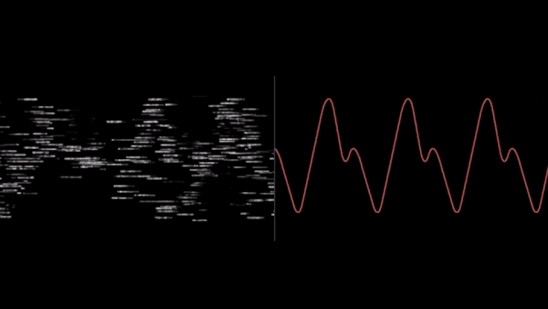

# DSP

    

## About the Projects

These Projects are part of the SBE 309 Medical Signal Processing Curriculum at the Faculty of Engineering, Cairo University

## Prerequisites

A good Understanding of **Python** Programming Language and one of its GUI Components (PyQt5)\
Some Familarity with some of python third party packages like **numpy**, **matplotlib** would be a plus\
basic understanding of the main concepts of OOP is a plus

However, you can apply the consepts of the projects with any other prefered programming language

## Projects List

|  # |                                       Project Name                                       |       Status       |
|:--:|:----------------------------------------------------------------------------------------:|:------------------:|
| 01 | [multiChannelSignalViewer](https://github.com/RamadanIbrahem98/multiChannelSignalViewer) | :heavy_check_mark: |
| 02 |          [sound-equalizer](https://github.com/RamadanIbrahem98/sound-equalizer)          | :heavy_check_mark: |
| 03 |          [kiss-ft-and-fft](https://github.com/RamadanIbrahem98/kiss-ft-and-fft)          | :heavy_check_mark: |
| 04 |              [image-mixer](https://github.com/RamadanIbrahem98/image-mixer)              | :heavy_check_mark: |
| 05 |             [Shazam-Clone](https://github.com/RamadanIbrahem98/Shazam-Clone)             | :white_check_mark: |

 

## 01 - [multiChannelSignalViewer](https://github.com/RamadanIbrahem98/multiChannelSignalViewer)

This Project is the first project in the semester and does not use any digital signal processing concepts yet. It is just a warm up to get comfortable using the GUI components

### Project Description

you are required to design a multi-channel (i.e. three) signal viewer
 
this application should present the signal in real-time like with the ability to play, pause, zoom in and out, auto pan the signal, move forward or backward in time, and change the speed of the signal
 
it is also required to have the ability to export the current scene as a PDF report
 
This PDF should be dynamic, meaning if I'm handling only one channel, it would generate the report for that one channel only. And if I'm using more than one channel, it should extract all of them and try fit them in the PDF as considered best fit
  
Final requirement is presenting the Spectrogram of the time signal, at this point of time, you are not required to have a broad understading of the subject, just the basics of spectrogram and what it represents

type of signal to use: any open-source medical signal (i.e. ECG, EEG, EMG, ...etc)

## Our Team

-   Ramadan Ibrahem - [![linkedin-shield]](https://www.linkedin.com/in/ramadanibrahem/)
-   Muhammad Seyam - [![linkedin-shield]](https://www.linkedin.com/in/mohamed-seyam-91b3b81b7/)
-   Muhammad Abd-ElAziz - [![linkedin-shield]](https://www.linkedin.com/in/mohamed-ahmed-abdelaziz)
-   Yousef Samir - [![linkedin-shield]](https://www.linkedin.com/in/youssef-samir-b24848191)

## Supervision

DR. Tamer Basha
 
T.A. Christina Adly

[linkedin-shield]: https://img.shields.io/badge/-LinkedIn-black.svg?style=flat-square&logo=linkedin&colorB=555